<div align="center">

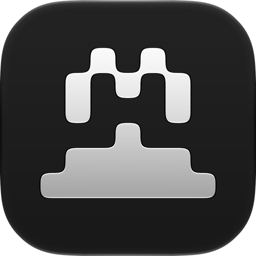

# Plaza

### A local‑first visual database & moodboard that lives on top of your real files

Plaza turns any folder of real files into a **visual database**, a **planning board**, and a **spatial moodboard** — for creative and VFX work. No account, no server, no git. All of Plaza's metadata lives in a hidden `.plaza/` folder, so projects sync for free through your own Dropbox or Drive and open intact on another machine.

`Tauri 2` · `React 19` · `Rust` · `Windows + macOS` · `v0.1.30`

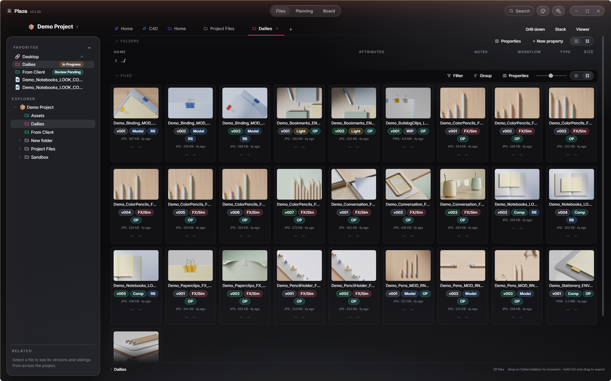

</div>

> **About these screenshots.** Everything below is captured from a real project — the **“Demo Project”**, a VFX‑style job whose files follow a naming schema (`Demo_Binding_MOD_ANIM_RB_v001.jpg`) across folders like `Dailies/`, `Assets/`, `Project Files/`, `From Client/` and `Sandbox/`. Plaza reads meaning straight out of those names.

---

## Table of contents

- [What is Plaza](#what-is-plaza)
- [Why Plaza](#why-plaza)
- [Core concepts](#core-concepts)
- [Projects & the dashboard](#projects--the-dashboard)
- [The workspace](#the-workspace)
- [Files mode — the visual database](#files-mode--the-visual-database)
- [Smart columns & naming schema](#smart-columns--naming-schema)
- [Previews, thumbnails & the Viewer](#previews-thumbnails--the-viewer)
- [Board mode — Canvas, Gallery & Sideboard](#board-mode--canvas-gallery--sideboard)
- [Planning mode](#planning-mode-alpha)
- [Search & deep links](#search--deep-links)
- [Settings & themes](#settings--themes)
- [Keyboard shortcuts](#keyboard-shortcuts)
- [Licensing & updates](#licensing--updates)
- [Files, sync & the `.plaza` folder](#files-sync--the-plaza-folder)
- [Architecture & branding](#architecture--branding)

---

## What is Plaza

Plaza is a lightweight desktop app (Windows + macOS) that points at a folder and turns it into three things at once:

- **Files** — a visual database where every file and folder is a row you can tag, rate, annotate and preview.
- **Planning** — a task tracker plus pipeline “swim‑lane” views that group your real files by stage, status or owner.
- **Board** — an infinite moodboard for arranging references, notes and links.

Plaza **never moves your files**. The only thing it adds to your folder is a hidden `.plaza/` directory holding boards, tags, attributes, notes and pasted assets. Delete Plaza and your files are exactly as they were.

- 🗂️ **Local‑first** — no account, no server, no cloud lock‑in.
- 🔁 **Sync for free** — `.plaza/` rides along in your own Dropbox/Drive and opens intact on another machine (Windows ↔ macOS).
- 🎬 **Built for creative/VFX pipelines** — reads versioned filenames, stacks sequences, previews PSD/EXR/C4D and more.
- 🪟 **A real native app** — Tauri 2 + React 19 + a Rust core, with a frosted‑glass design system and five themes.

---

## Why Plaza

Creative pipelines live as **thousands of versioned files on disk**. Existing tools force a bad trade‑off:

| The problem | Plaza's answer |
|---|---|
| Asset managers **copy everything** into a proprietary library | Plaza works on your **real files in place** — no import, no duplication |
| Plain file browsers **ignore the meaning** of your filenames | Plaza **reads VFX‑style naming schemas** and derives Version / Task / Owner / Shot columns live |
| Cloud tools need **accounts, servers and uploads** | Plaza is **local‑first**; metadata syncs through *your* Dropbox/Drive |
| Renames and moves **break your tags and links** | Plaza glues metadata to files with **stable entity ids** that survive renames |
| You can't see what changed on disk | A **live filesystem watcher** keeps the UI in sync as files appear, move or disappear |

---

## Core concepts

A small mental model goes a long way:

- **A project is just a folder** you point Plaza at. The hidden `.plaza/` folder holds all of Plaza's data.
- **Files and folders are rows.** You add typed property columns over them — it's a database whose rows are real files.
- **Stable entity ids (eids)** bind tags, board cards and task links to files, so everything survives external renames and moves.
- **Three modes, one window** — *Files*, *Planning* and *Board* — switch from the centered toggle or with `Ctrl/⌘ + 1 / 2 / 3`.
- **Public or Private metadata** — `.plaza/` can live *inside* the project folder (syncs with the files) or be *kept separate* per‑machine (so two people can arrange the same shared files their own way).

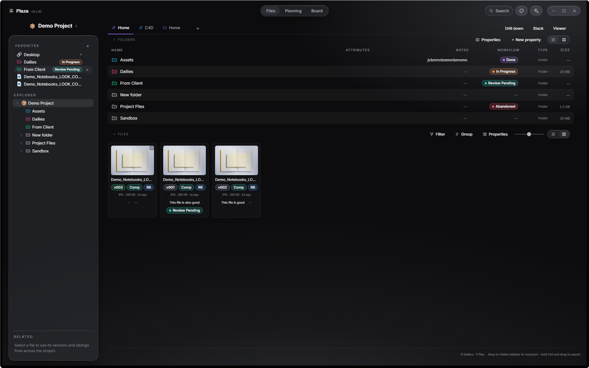
*<sub>The anatomy of a project: top app bar with the three‑mode switcher, a full‑height left sidebar (Favorites + Explorer), folder tabs, and the main column split into **Folders** and **Files** blocks — each folder carrying its own Status tag.</sub>*

---

## Projects & the dashboard

The home screen is a grid of project cards under an **Ongoing** heading, over a faint Plaza sigil watermark. Each card shows a cover (thumbnail or tinted icon), the project name, when it was last opened, and its folder path.

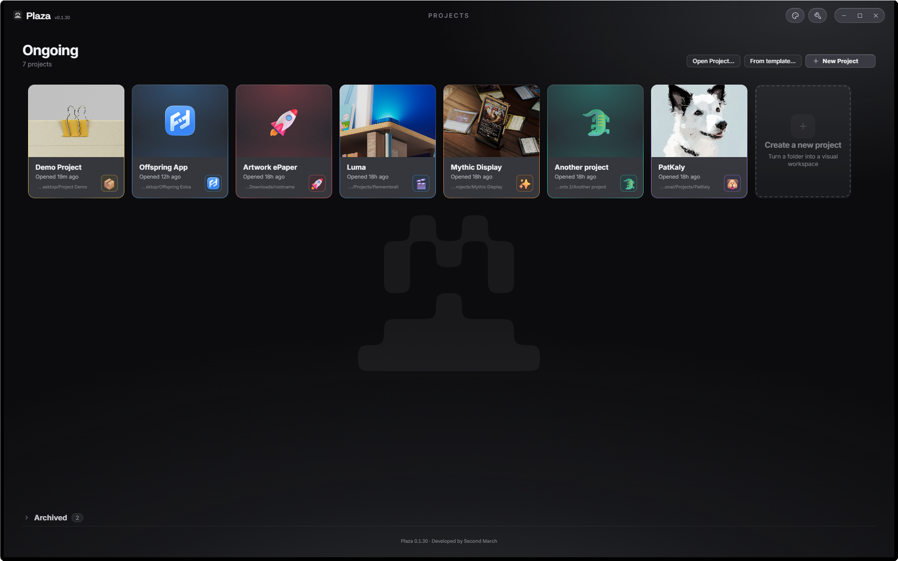
*<sub>The dashboard. Cards open a project on click; the dashed tile creates a new one. Top‑right: **Open Project…**, **From template…** and **New Project**.</sub>*

**Switch projects** without leaving your work from the project‑name dropdown in the top bar — or jump back to **All projects**.

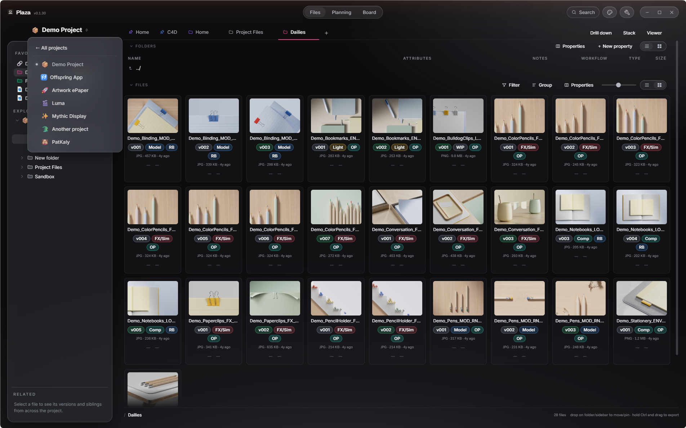
*<sub>The top‑bar project switcher. The current project is marked; unavailable folders are disabled (“Not available on this machine”).</sub>*

**Create a project** with a two‑step wizard: name it, give it an emoji/Material‑symbol/image icon and a color, then place it. *Pick an existing folder* adopts a folder in place; *Create a new folder* makes one named after the project. Step two chooses where the `.plaza/` data lives — **in the project folder** (Public) or **kept separate** (Private).

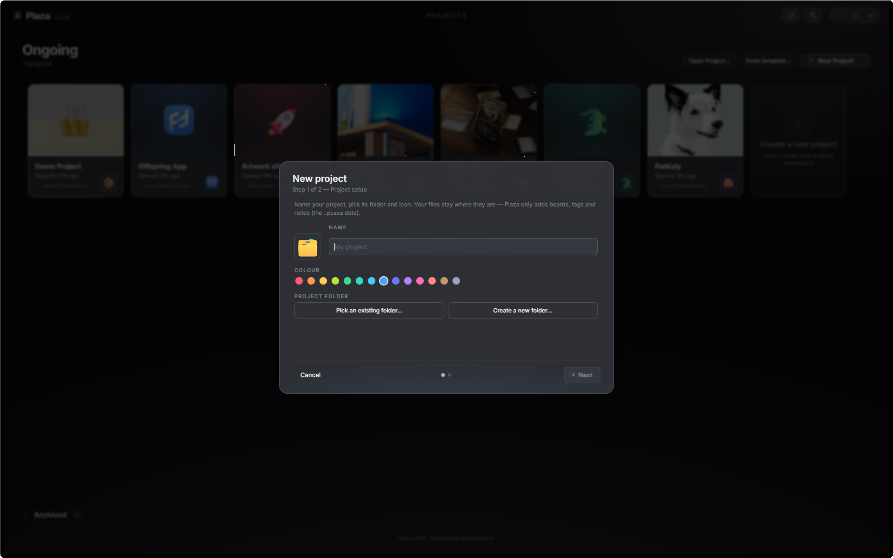
*<sub>New Project, step 1. Plaza only ever adds the hidden `.plaza/` folder — your files stay where they are.</sub>*

Each card has a **deep more‑actions menu**: Open / Locate, Rename, Reveal in Explorer/Finder, Relink, Archive, Change icon, a 14‑color swatch row, Set/Change/Remove thumbnail, **Save as project template**, Remove from list, and a guarded red **Delete project & files** (a two‑step trash to the OS Recycle Bin that lists the exact paths first).

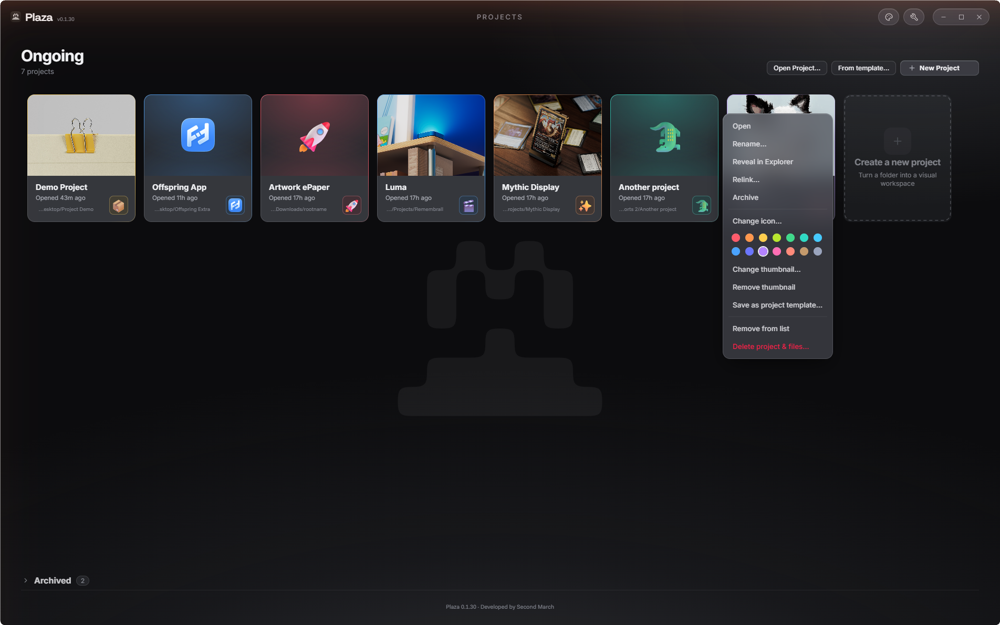
*<sub>Per‑project actions, including templates, custom thumbnails, archive, relink and a safe two‑step delete. “Remove from list” forgets a project without touching the disk.</sub>*

Other dashboard features: a collapsible **Archived** section (drag a card onto it to archive), **relink/locate** for moved or offline folders with status badges, and **From template** to scaffold a folder structure from a saved or built‑in template.

---

## The workspace

Inside a project, Plaza is a **top app bar**, a **full‑height resizable left sidebar**, and a **main column** — all in the frosted‑glass design language.

- **Top app bar** — Plaza home button, version + update pill, the three‑mode switcher (centered), and Search / Theme / Settings (plus the window controls on Windows).
- **Left sidebar** — resizable and collapsible to a peek strip. It hosts **Favorites** (pinned files/folders/links), the **Explorer** folder tree, and a **Related** panel; its contents change per mode.
- **Folder tabs** — open, pin, reorder and close session tabs. Pinned tabs lock to a folder and come back when you return; each can carry a color and a tag chip.

The empty regions of the top chrome double as window **drag handles**.

---

## Files mode — the visual database

Files mode browses your real folder as two blocks — **Folders** and **Files** — each a table whose rows are files/folders and whose columns are **typed properties** layered over the real files. It's a capable file browser (tabs, tree, breadcrumbs, drill‑down, stacks) fused with Notion‑style columns, tags, filtering and grouping.

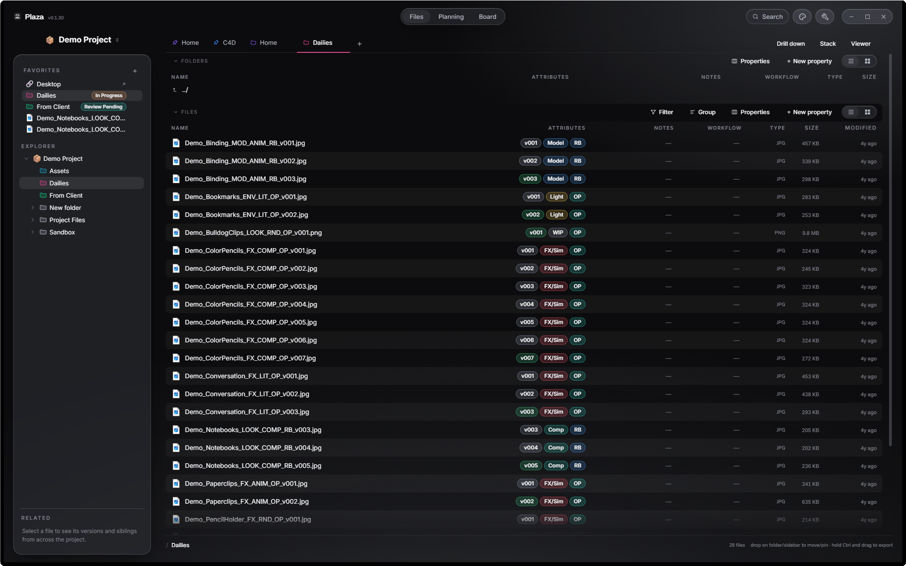
*<sub>List view: rows are real files; columns mix built‑ins (Type, Size, Modified) with typed properties and the derived smart‑column chips (Version · Stage · Owner).</sub>*

Toggle any block to a **thumbnail grid**, where attribute values ride along as compact caption chips:


*<sub>Grid view of the `Dailies/` folder — real rendered thumbnails, each badged with its version, stage and owner.</sub>*

### Typed properties

Add as many property columns as you like. Click **+ New property** and pick a type:

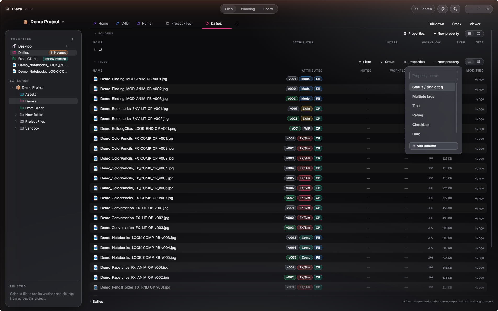

> **Status / single‑select tag · Multiple tags · Text · Rating · Checkbox · Date · Link** — plus a seeded **Status** attribute (To Do / Doing / Review / Done) that's shared with Planning.

Tags are **Notion‑style**: type to create, then recolor (14 colors), rename or delete inline.

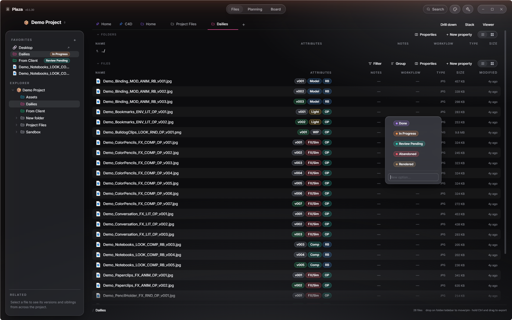
*<sub>Inline tag management — create, recolor and rename without leaving the cell.</sub>*

### Columns, sorting, filtering & grouping

- **Columns** — click headers to sort; drag grips to resize; drag to reorder; right‑click for Sort / Group by / Rename / Hide / Delete and the checkbox “cross‑out” option.
- **Filter by value** — a submenu per column lets you keep only the rows you want (e.g. *Owner = RB*, *Stage = Light*). AND across columns, OR within.
- **Group by** any column into collapsible lanes.

<table>
<tr>
<td width="33%">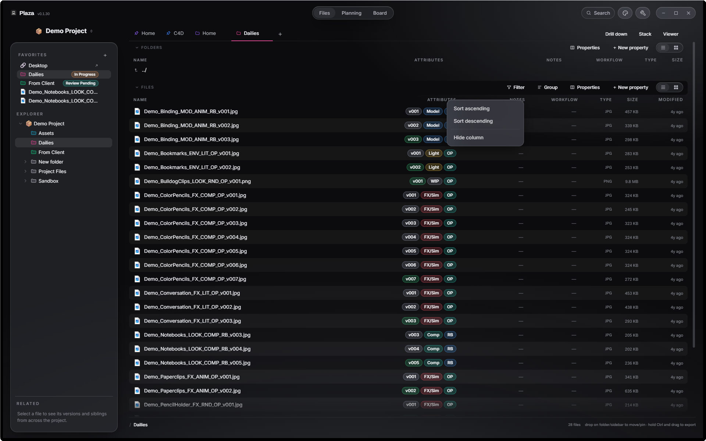<br><sub>Right‑click a header to sort or hide it.</sub></td>
<td width="33%">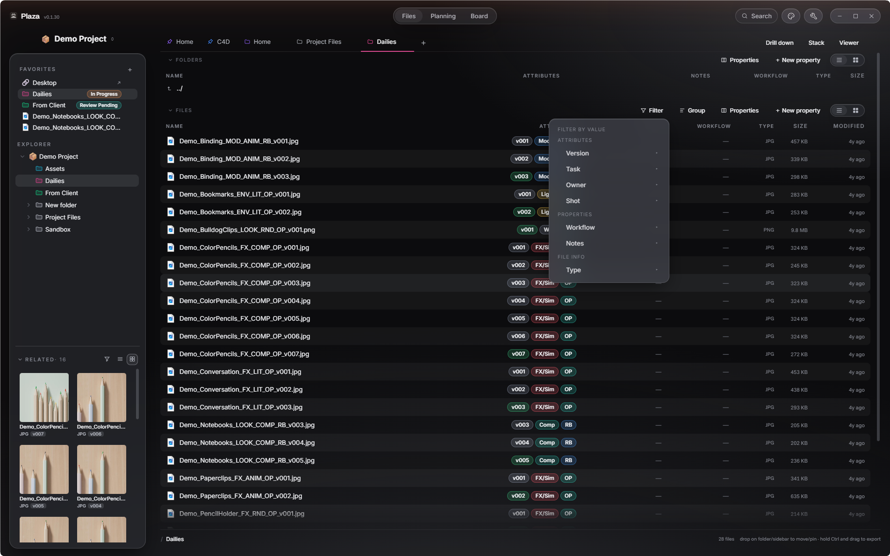<br><sub>Value‑based filtering per column.</sub></td>
<td width="33%">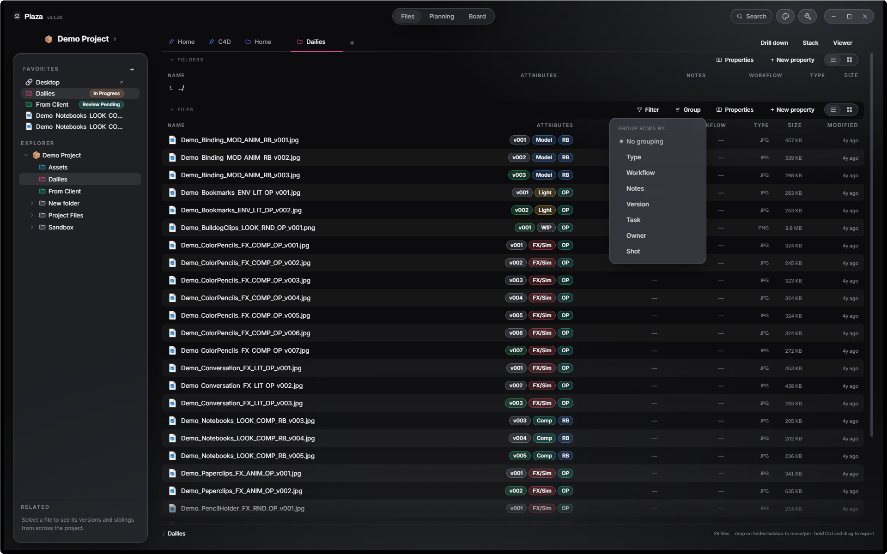<br><sub>Group rows by any column.</sub></td>
</tr>
</table>

### Browsing power

- **Folder tabs**, an **Explorer tree** and a breadcrumb footer (root = *Home*) with live folder/file/sequence/stack counts.
- **Drill down** flattens a folder to every file in its subfolders.
- **Marquee multi‑select** by rubber‑banding empty space; `Ctrl/⌘`‑click toggles, `Shift`‑click ranges. Two or more selected reveals a **Selection bar** (bulk attributes, tags, move, Send to Sideboard, compare, trash).
- **Inline rename** with a slow second click on a selected name, or right‑click → Rename.
- **Drag to move** onto a folder, the tree or the sidebar (`Ctrl/⌘ + Z` undoes); drop files in to import; hold `Option/Ctrl` while dragging out to **export a copy** to Explorer/Finder.
- A right‑click menu on any file: **Open, Reveal in Explorer/Finder, Rename, Save as new version, Send to Sideboard, Pin to favorites, Copy path, Copy Plaza link**, and a per‑kind **Move to trash**.

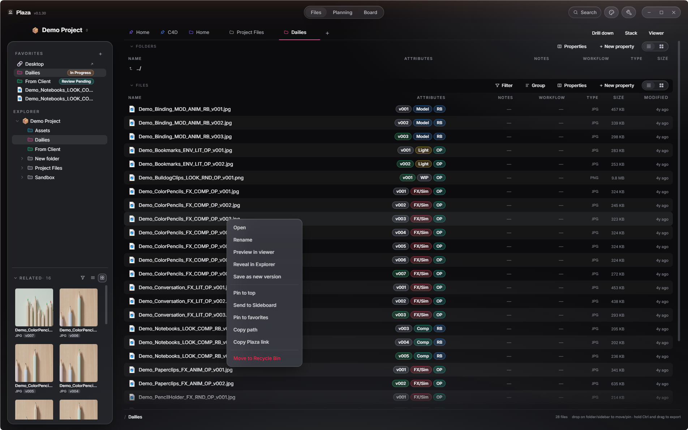
*<sub>The per‑file menu. Note **Save as new version**, **Send to Sideboard** (the bridge into Board mode) and **Copy Plaza link**. The Related panel on the left shows the file's version siblings.</sub>*

---

## Smart columns & naming schema

This is Plaza's signature trick: turn on **filename attributes** for a project and Plaza parses every file name against a separator and an optional token pattern, then surfaces read‑only **smart columns** — derived live, never written to disk.

A VFX‑style name decomposes automatically:

```
Demo_Binding_MOD_ANIM_RB_v001.jpg
     │       │   │    │   └── Version  → v001  (green = current, grey = superseded)
     │       │   │    └────── Owner    → RB    (initials, colored chip)
     │       │   └─────────── (Stage)
     │       └─────────────── Task/Stage → Model
     └─────────────────────── (asset name)
```

- **Version** — detects `v` + digits at a token boundary (rightmost wins; a trailing number becomes a minor, `v01_2 → v01.08`). Highest version in its group is **green/current**, older ones **grey/superseded**.
- **Task / Stage** — matched against an editable dictionary (WIP, Model, Rig, Layout, Anim, FX‑Sim, LookDev, Light, Render, Comp…).
- **Owner** — 2–4 letter initials after the stage token, as a hashed‑color chip.
- **Shot / Scene** — `SH0420`, `SC010`, `SQ020`, `SEQ030`, or a bare numeric fallback.

These smart columns **double as filter and group dimensions** — filter Version to “current only”, or group the whole folder by Owner or Stage. They're configured per‑project in **Settings → Project**:

<table>
<tr>
<td width="50%">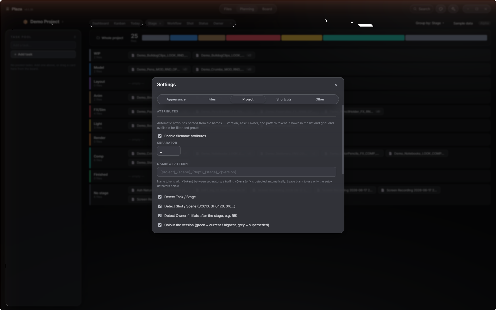<br><sub>Enable filename attributes, set the separator and naming pattern, and toggle the Task/Stage, Shot, Owner and version detectors.</sub></td>
<td width="50%">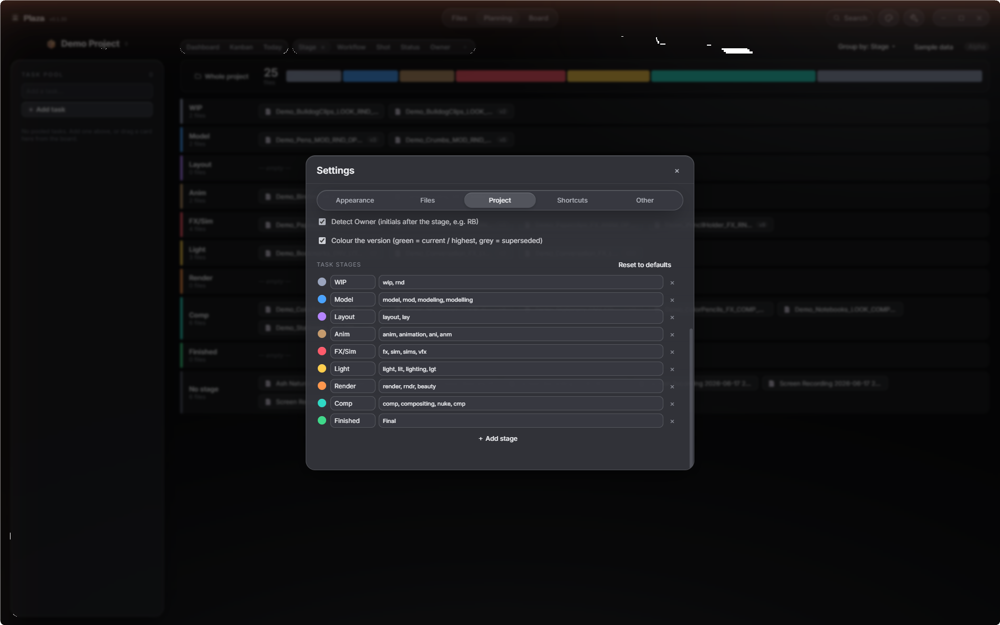<br><sub>The fully editable **Task‑stage dictionary**: a color, a label and the matching tokens per stage.</sub></td>
</tr>
</table>

The **Related panel** uses the same parsing to link DCC **source files** (`.c4d`, `.blend`, `.ma/.mb`, `.hip`, `.nk`, `.aep`…) to their render outputs and version siblings by a shared stem — ranked by token overlap and version proximity.

---

## Previews, thumbnails & the Viewer

Because a folder becomes a visual library, **previews are everywhere**. Every tile and row renders a real thumbnail whenever one can be made:

- **In‑app** decoding for raster (PNG/JPG/GIF/WebP/TIFF/BMP…), **SVG** (via resvg) and **EXR/HDR** (Reinhard‑tonemapped).
- **Cinema 4D** previews by carving the embedded editor JPEG straight out of the `.c4d` — *no Cinema 4D install required*.
- **OS providers** for PDF, PSD/PSB, AI/EPS, RAW (CR2/NEF/ARW/DNG…), HEIC and video (when a system thumbnailer exists).
- A **per‑machine on‑disk cache** keyed by path + mtime + size + content hash (never synced), with transparency‑preserving PNGs.

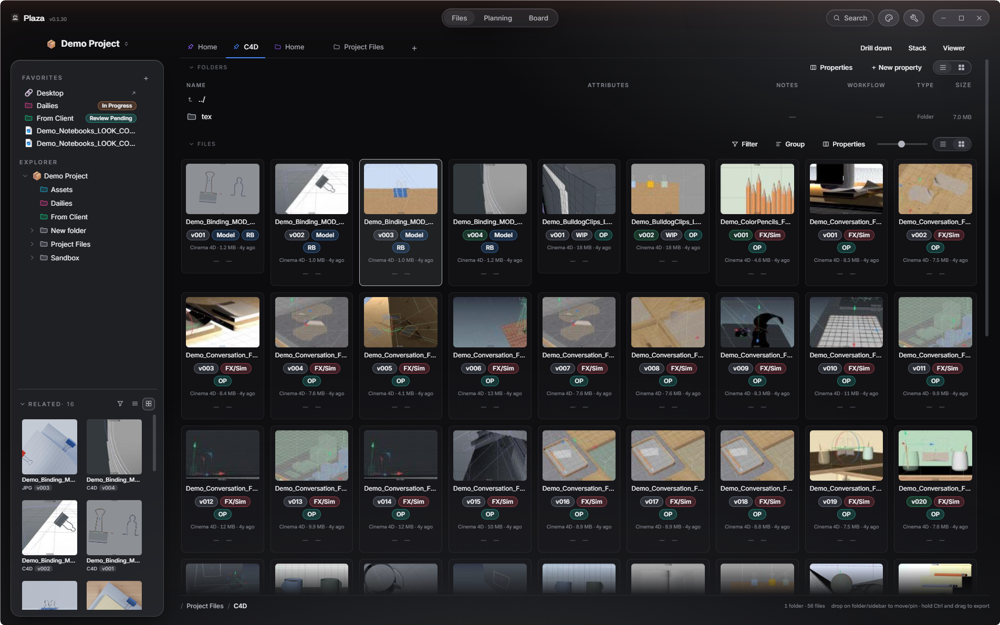
*<sub>The `Project Files/C4D` folder — `.c4d` files previewed from their embedded editor image, each tagged with its smart‑column chips.</sub>*

### The Viewer / inspector

Toggle the **Viewer** to get a resizable right pane with a large zoomable preview, an auto‑extracted **color palette**, and **inline‑editable attributes** for the selected file. Images zoom/pan (1×–4×), video plays inline, and audio gets a waveform. Press **Space** for a fullscreen **Quick Look**.

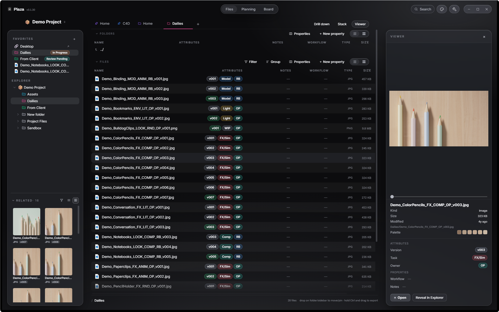
*<sub>The Viewer doubles as an inspector — preview, color palette, file facts and editable Version/Task/Owner, with Open and Reveal buttons.</sub>*

### Stacks

The **Stack** toggle collapses noise into single tiles:

- **Image sequences** (`shot_0001.exr…`) become one tile with a middle‑frame thumbnail, frame count, first–last range and a gap warning.
- **Version stacks** (files differing only by a `vNNN` token) collapse to the latest, with a `×N` depth badge.

<table>
<tr>
<td width="50%">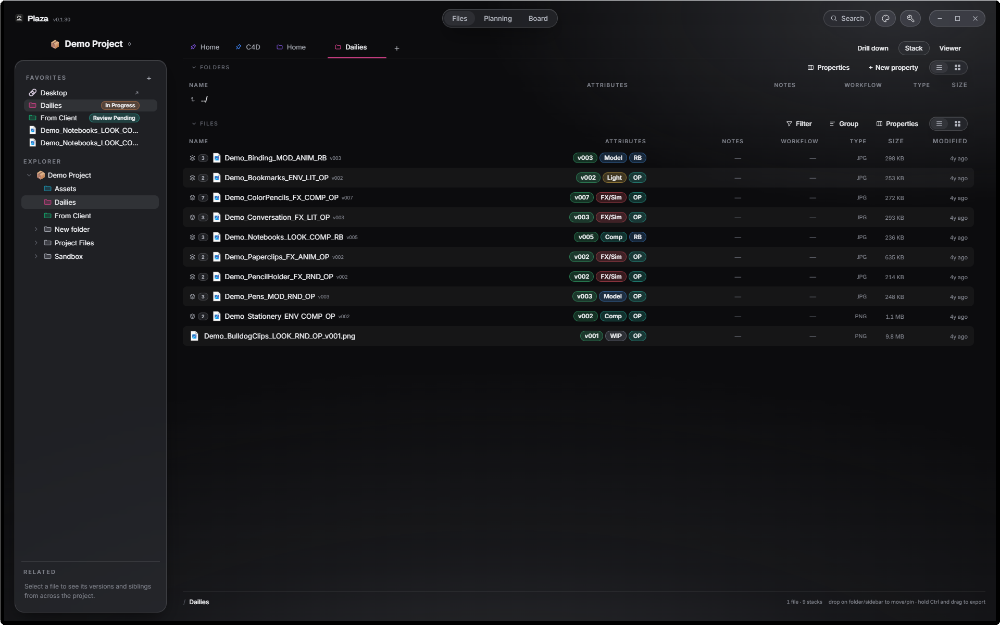<br><sub>List view: 28 files collapse to “9 stacks”, each with a version count.</sub></td>
<td width="50%">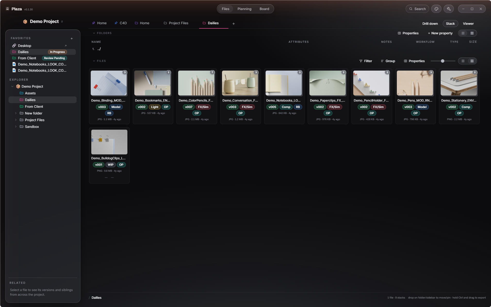<br><sub>Grid view: the same stacks as photo‑stack tiles with depth badges.</sub></td>
</tr>
</table>

Right‑click a stack to **pin**, **color**, **Compare versions…** (an A/B overlay) or **Save as new version**.

---

## Board mode — Canvas, Gallery & Sideboard

Board mode is Plaza's spatial moodboard. Two views share one collection: an **infinite Canvas** for arranging cards, and a **Gallery** grid of everything. A **Sideboard** sidebar stages off‑canvas items and browses your project's media.

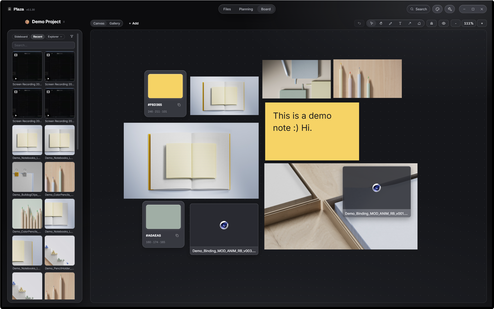
*<sub>The Canvas: pan/zoom (15–400%), drop images, notes, links, color chips and file references, and annotate with pen/text/arrow tools (toolbar, top‑right).</sub>*

- **＋ Add** a sticky Note, code Snippet, Color chip, Link (with live OpenGraph preview) or Image/File from disk.
- **Card kinds** — images, inline‑playing videos, file chips, link previews, notes, syntax‑highlighted snippets, color chips, and section frames that group cards.
- **Move / resize / rotate / recolor** with an 8‑handle selection ring, corner rotate zones (`Shift` = 15° steps), and a floating toolbar (recolor, rotate, duplicate, send‑to‑back, delete).
- **Annotation tools** — Select `V`, Pan `G`, Draw `P`, Text `T`, Arrow `A`, Eraser `E` — with a color picker and brush‑size slider. A text formatting bar offers font, size, bold/italic and alignment.
- **Snap to grid & edges**, **Overlay (ghost) mode** for tracing over another app, and per‑gesture **Undo**.
- **Rename‑proof file cards** — image/file cards bound to in‑project files auto‑heal after an external rename via their entity id; a **Missing — relink** badge handles the rest. **Collect external (N)** copies loose external assets into `.plaza/assets` so the board is self‑contained.

The **Gallery** shows the whole collection with place/unplace badges, a card‑size slider and an **On canvas only** filter:

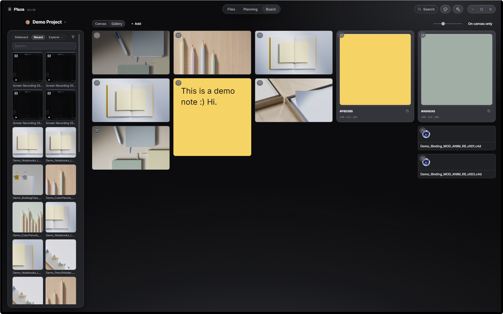
*<sub>Gallery: every item in the board at a glance — image cards, a sticky note, color chips and `.c4d` file references — each badged for whether it's on the Canvas.</sub>*

The **Sideboard** sidebar switches its source between off‑canvas items, **Recent** project media, or any **folder**, with a faceted filter (Type / Stage / Owner). Drag a card onto the Canvas to place it **without copying**, or drop images on the shelf to stash them as references. The whole board is saved per project to `.plaza/board.json`.

---

## Planning mode (alpha)

Planning mode is Plaza's third workspace — an early‑preview feature that fuses a task tracker with **pipeline “swim‑lane” views over your real files**. Tasks are backed by real entities (so they sync and survive like everything else) and link to files by **stable id**, so a plan stays glued to the work even as files are renamed.

A **Dashboard** gives the read‑only overview:

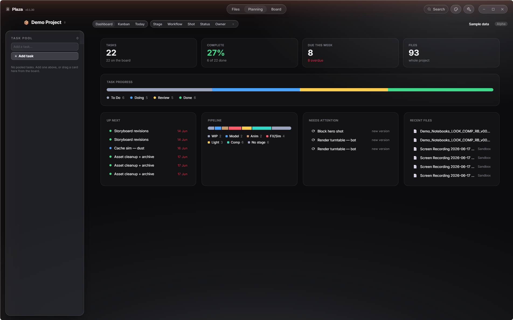
*<sub>Stat tiles (Tasks · Complete % · Due this week · Files), a status progress bar, and Up next / Pipeline / Needs attention / Recent files widgets.</sub>*

A **Kanban** board has one lane per Status; drag cards between lanes to change status, link a file with 📎, and set a due date with 📅:

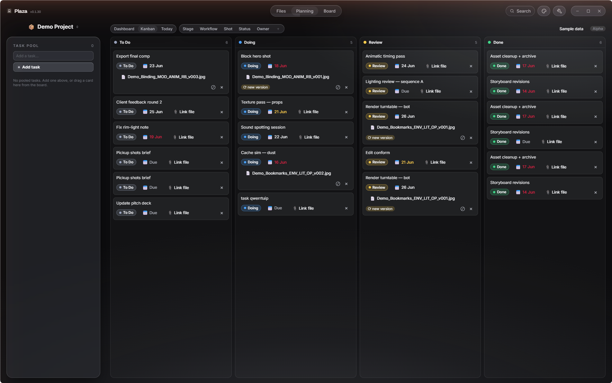
*<sub>To Do / Doing / Review / Done lanes filled with task cards; status‑less tasks live in the sidebar **task pool**.</sub>*

A **Today** agenda sorts by urgency and surfaces a **Needs attention** section — missing files and the **“⟳ new version”** signal that fires when a linked file is superseded on disk:

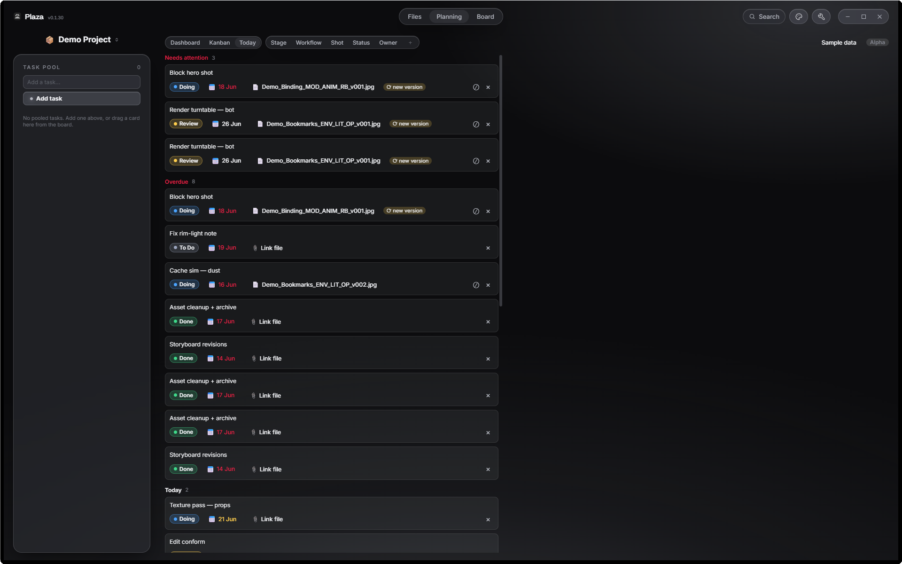
*<sub>Overdue / Today / This week / Later, with a red Needs‑attention section for stale or missing links.</sub>*

The headline trick: **grouped file views** bucket your *real files* into pipeline lanes by Stage, Status, Owner, Shot or any single‑tag attribute. Drag a card to a lane to reassign it; version siblings collapse into stacks.

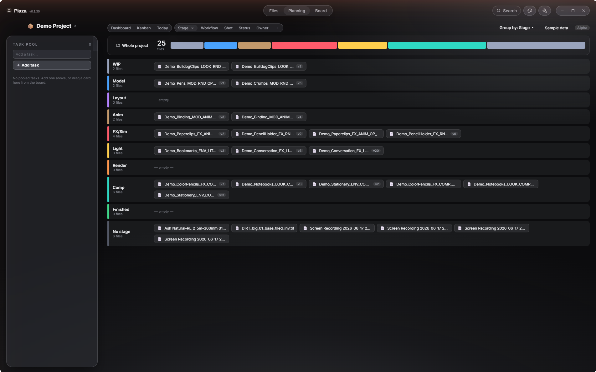
*<sub>The whole project's files, auto‑bucketed into stage lanes (WIP → Model → Anim → FX/Sim → Light → Comp → Finished) by their filename Stage token.</sub>*

> Planning is enabled per‑machine via **Settings → Other → Experimental**, and ships a **Sample data** button that seeds example tasks so every view lights up.

---

## Search & deep links

Press `Ctrl/⌘ + K` for a command‑palette search that recursively indexes the whole project and ranks by name, attributes, tags and the filename‑derived columns — with a surprisingly rich **natural‑language** query language.

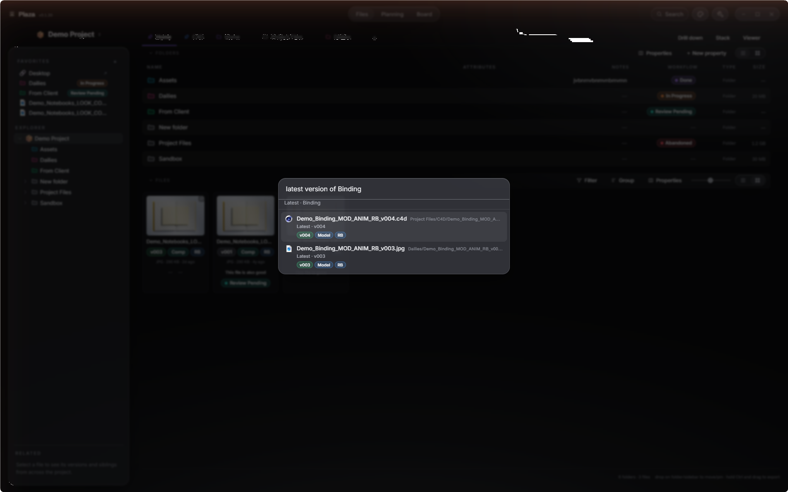
*<sub>“latest version of Binding” → Plaza interprets the intent and returns the current `v004.c4d` and `v003.jpg`, each with its smart‑column chips.</sub>*

- **Structured operators** — `type:`, `modified:`/`created:` (`today`, `yesterday`, `last week`, dates, `>=`/`<=`), `attr:`, `name:`, `latest:`, `stack:`, `in:`, `status:current|superseded`.
- **Natural‑language phrases** — *“images modified yesterday”*, *“videos modified last week”*, *“latest version of HANDBAG”*; a live summary line shows how Plaza read your query.
- Result rows show an icon, path, a match label and chips. `Enter` reveals in Files; `Ctrl/⌘ + Enter` opens in the OS app.

**`plaza://` deep links** turn any file or folder into a shareable URL. **Right‑click → Copy Plaza link** packs the project's UUID + the item's path (and stable id when tagged). Opening the link on any machine that has the project launches Plaza, resolves the project, and reveals + selects the exact item — surviving renames via the embedded id.

---

## Settings & themes

Settings open from the gear/wand icon into a tabbed dialog — **Appearance · Files · Project · Shortcuts · Other**. Most controls persist instantly and take effect live.

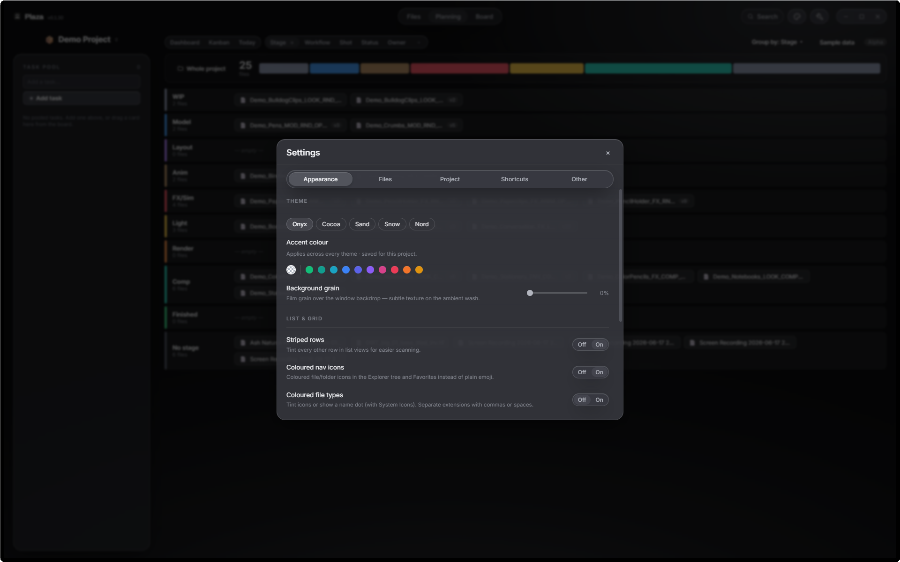
*<sub>Appearance: the five themes, a per‑project accent color, and a film‑grain slider.</sub>*

**Five frosted‑glass themes**, switchable here or by cycling the top‑bar palette icon:

<table>
<tr>
<td width="50%">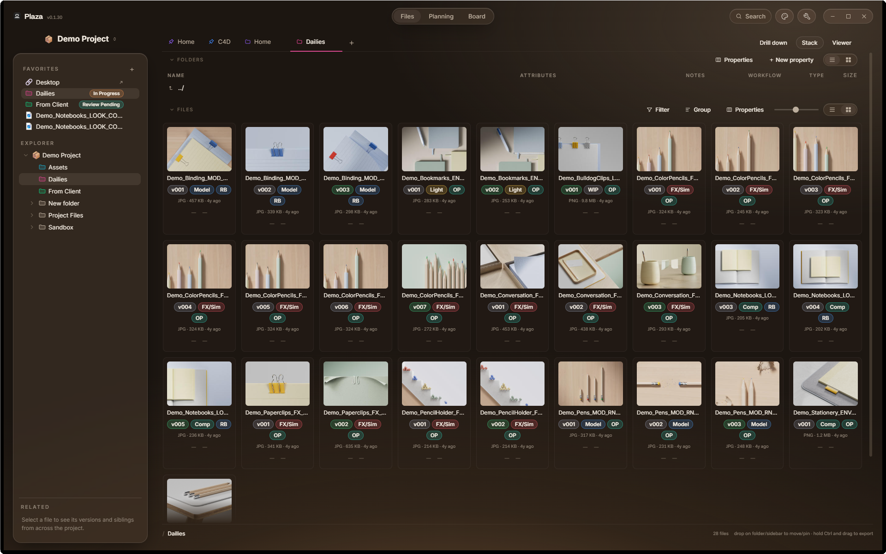<br><sub><b>Cocoa</b> — warm dark.</sub></td>
<td width="50%">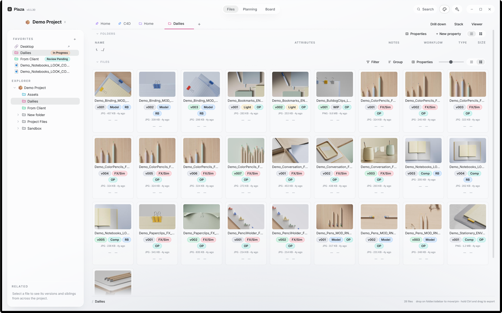<br><sub><b>Snow</b> — neutral light.</sub></td>
</tr>
</table>

> **Onyx** (dark, default) · **Cocoa** (warm dark) · **Sand** (warm light) · **Snow** (neutral light) · **Nord** (cool dark). Each is a single set of CSS variables, re‑applied before first paint to avoid a flash.

The rest of the tabs:

<table>
<tr>
<td width="50%">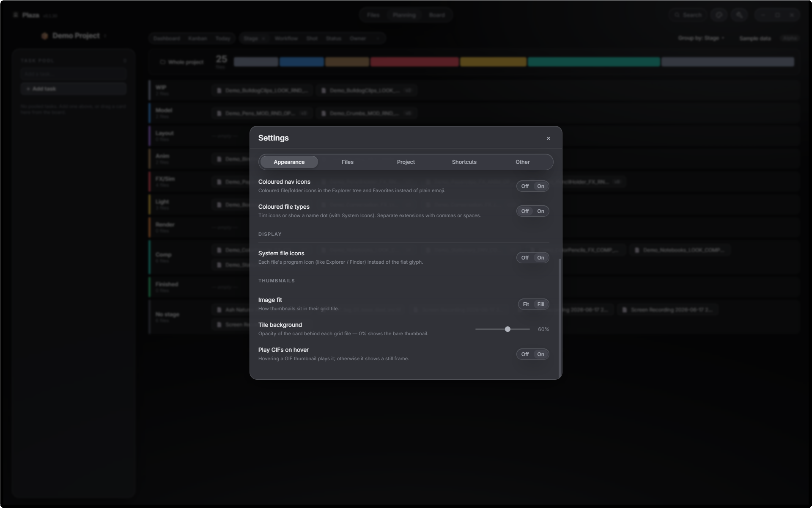<br><sub><b>Appearance</b> — striped rows, colored nav/file icons, image Fit/Fill, tile‑background opacity, play GIFs on hover.</sub></td>
<td width="50%">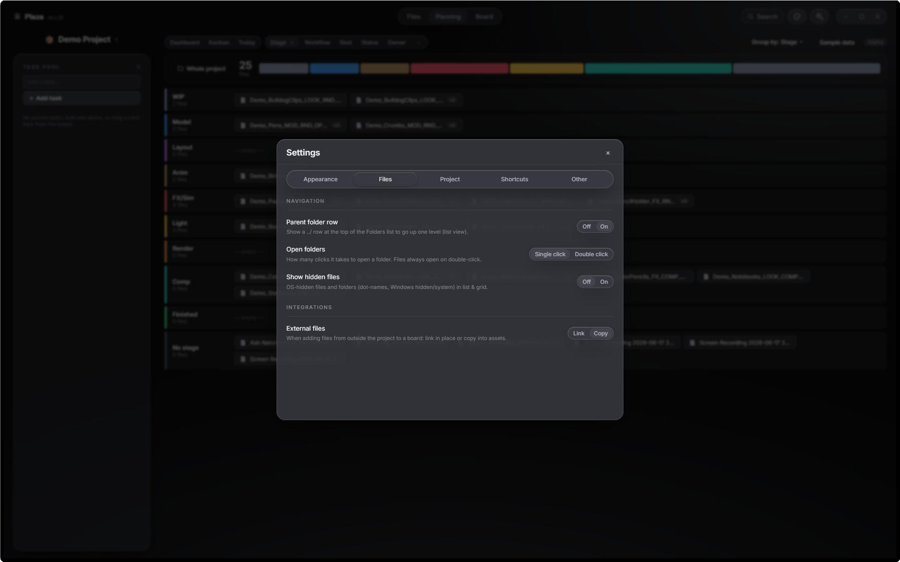<br><sub><b>Files</b> — parent‑folder row, single/double‑click open, show hidden files, and the external‑drop Link/Copy policy.</sub></td>
</tr>
<tr>
<td width="50%">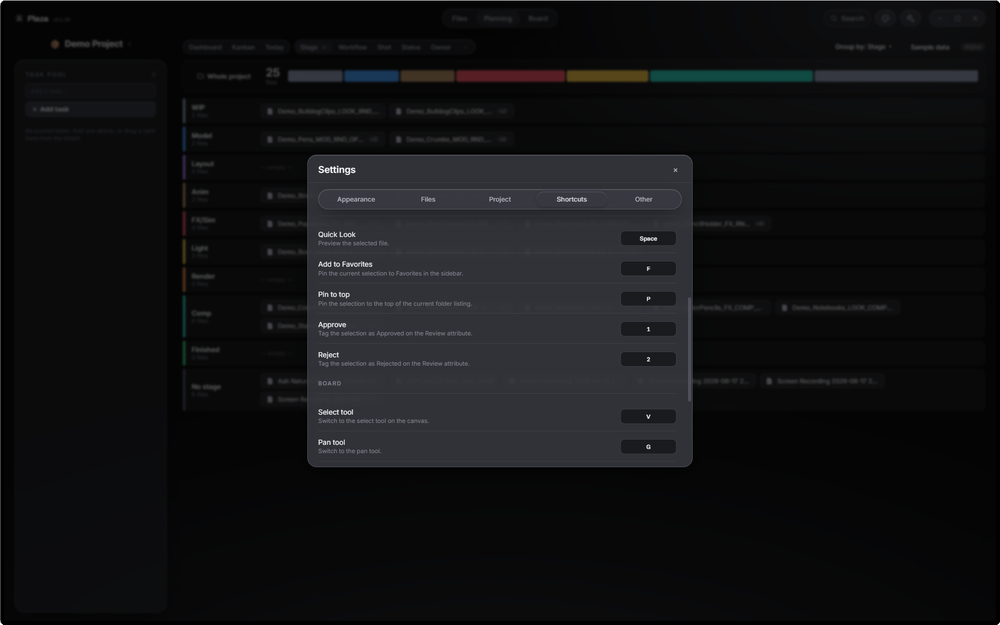<br><sub><b>Shortcuts</b> — every binding is remappable, with click‑to‑record and conflict detection.</sub></td>
<td width="50%">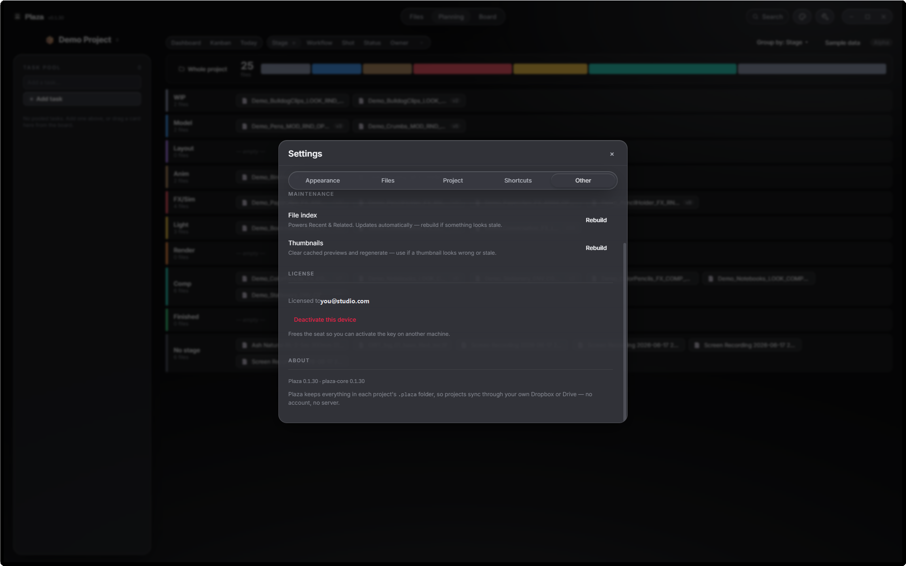<br><sub><b>Other</b> — Maintenance (rebuild index/thumbnails), License management, and About.</sub></td>
</tr>
</table>

---

## Keyboard shortcuts

Plaza is keyboard‑driven; the bindings below are remappable in **Settings → Shortcuts**.

| Scope | Action | Default |
|---|---|---|
| General | Search | `Ctrl/⌘ + K` |
| General | Toggle sidebar | `H` |
| General | Files / Planning / Board mode | `Ctrl/⌘ + 1 / 2 / 3` |
| Files | Quick Look | `Space` |
| Files | Add to Favorites | `F` |
| Files | Pin to top | `P` |
| Files | Approve / Reject | `1` / `2` |
| Board | Select · Pan · Pen · Text · Arrow · Eraser | `V` · `G` · `P` · `T` · `A` · `E` |

Built‑in keys that aren't remappable: `Ctrl/⌘ + Z` undo (mode‑scoped), `Delete/Backspace` (trash selection / remove board items), arrow keys to navigate the grid, `Esc` to close overlays, `Enter` to commit renames / reveal a result, `Ctrl/⌘ + D` to duplicate a board card.

---

## Licensing & updates

The app is gated behind a **Lemon Squeezy** license with a **14‑day free trial**. On launch Plaza reads a cached status from the OS keychain (with a 14‑day offline grace), then re‑validates online in the background.

- **Trial** shows a floating “Trial · N days left” pill; the trial timestamp lives in the OS credential vault.
- **Active** unlocks the app; **expired / unlicensed / invalid** show a blocking activation screen with a key field and a *Purchase Plaza* link.
- Manage it in **Settings → Other → License** — *Licensed to … · Deactivate this device* frees the seat for another machine.

An **auto‑updater** checks the GitHub releases feed on launch. An *Update to vX.Y.Z* pill appears in the top bar; clicking it downloads and installs in place (live percentage) and relaunches.

---

## Files, sync & the `.plaza` folder

Plaza is local‑first and **never relocates your files**. All of its state lives in a hidden `.plaza/` folder next to them:

```
<project>/
  .plaza/
    project.json       manifest: { id (uuid), name, icon, color, createdAt }
    attributes.json    the visual‑database schema + naming schema
    pins.json          Favorites
    workspace.json     per‑project UI state (tabs, columns, filters, sidebar width…)
    board.json         the Board (Canvas + Gallery items, annotations)
    planning.json      Planning tasks (migrated into entity shards)
    index.json         a lean file index (powers Recent & Related)
    entities/<id>.json one file per annotated file/folder/task
    assets/<uuid>.<ext>  images pasted/dropped onto a board
  <your real files…>
```

- **Sync for free** — put the folder in your own Dropbox/Drive. Metadata is **sharded per entity** with atomic writes so concurrent edits merge cleanly instead of conflicting on one big file.
- **Public vs Private** `.plaza` data — inside the folder (syncs with the files) or kept separate per‑machine (so two people can arrange the same shared files independently).
- **Live filesystem watcher** — Plaza coalesces on‑disk changes (~150 ms) and refreshes the file list, tree, index and Planning tasks, ignoring its own `.plaza/` writes.
- **Drag in / out** — drop files in to import (collision‑safe), or `Option/Ctrl`‑drag a card out to Explorer/Finder as a real copy. External drops follow a **Link vs Copy** policy.
- The thumbnail cache is **per‑machine and never synced**.

---

## Architecture & branding

Plaza is a genuine native app, not a web wrapper:

- **Tauri 2 + React 19 + a Rust core** (`crates/plaza-core` engine + a thin `src-tauri` command layer); identifier `co.honear.plaza`.
- A **frameless window** with custom Windows chrome and native macOS traffic lights.
- A fully **tokenized frosted‑glass design system** — one set of CSS variables per theme over an ambient radial wash — with five themes, an opt‑in per‑project accent, and a 14‑color Notion‑style tag palette.
- **Self‑hosted fonts** (Inter for UI, Funnel Sans for paths/badges/versions, Funnel Display for the wordmark, Material Symbols) so it works fully offline.
- The **Plaza mark** (a fountain on a rounded squircle) is the app icon and top‑bar glyph; a vector **sigil** watermark sits behind the dashboard.
- Performance is built in: bucketed, lazy, concurrency‑limited thumbnails; memoized board rendering; and an entity‑id store that keeps metadata glued to files across renames and moves.

---

<div align="center">
<sub>Plaza v0.1.30 · built with Tauri 2 + React 19 + Rust · developed by Second March</sub>
</div>
